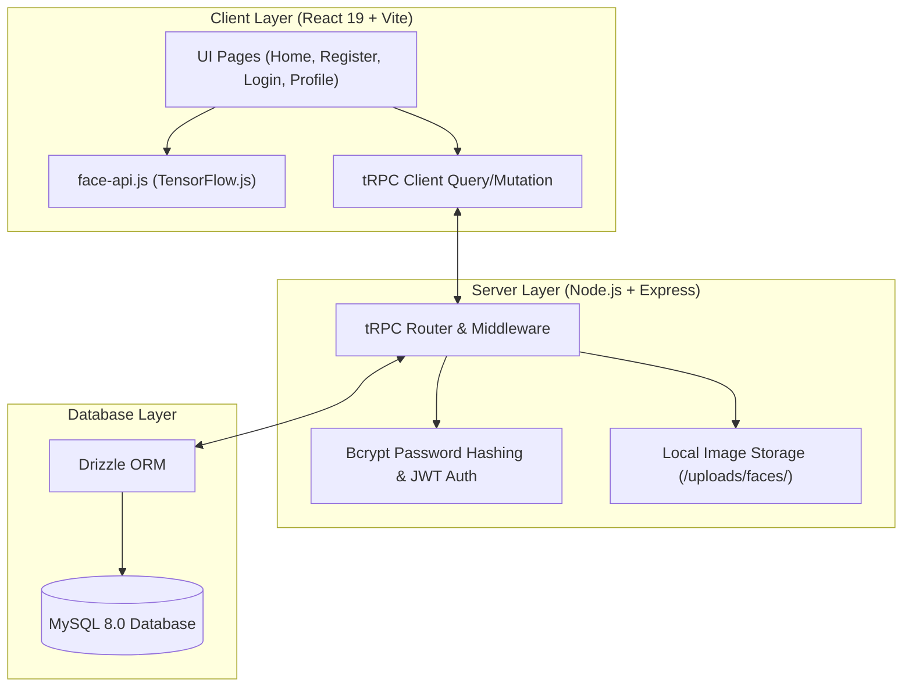

# Project Report: FaceLiveness AI – Biometric Authentication & Face Liveness Detection System

## Executive Summary

**FaceLiveness AI** is a biometric identity verification and passwordless authentication web platform. It leverages browser-based deep learning models (`face-api.js` backed by TensorFlow.js) alongside server-side verification to authenticate users through live camera feeds.

The platform solves spoofing vulnerabilities (such as static photo presentations, video replays, and printed masks) by enforcing **interactive 2-step liveness challenges** (Eye Aspect Ratio blink detection and head pose/mouth movement verification) before computing 128-dimensional facial embedding distances for 1:1 identity matching.

---

## 🛠️ Technology Stack Architecture



### Stack Breakdown
- **Frontend Framework**: React 19 + TypeScript + Vite
- **UI Components & Styling**: Tailwind CSS, Radix UI primitives, Lucide React icons, Sonner toasts
- **Routing**: Wouter
- **API & State Management**: tRPC, `@tanstack/react-query`, Zod schema validation
- **Biometric Processing**: `@vladmandic/face-api` (TinyFaceDetector, 68-Landmark Estimator, Face Descriptor Net)
- **Backend API**: Node.js, Express, tRPC Server
- **Database & Storage**: MySQL 8.0, Drizzle ORM, Local File System Storage (S3-compatible proxy)

---

## 🔑 Core Features & Functionalities

### 1. User Registration & Face Enrolment
- **Account Creation Form**: Collects full name, email address, password, date of birth, and department.
- **Form Validation**: Client-side and server-side input validation using Zod. Passwords are securely hashed using `bcrypt`.
- **Live Face Capture**: Captures webcam stream frame to HTML5 Canvas and extracts a 128-float facial descriptor array.
- **Image & Template Storage**: Saves captured JPEG image under local `/uploads/faces/` directory and persists the JSON-serialized embedding into the database (`faceImages` table).

---

### 2. Interactive AI Face Liveness & Anti-Spoofing Engine

To prevent spoofing attacks (photos, phone screen replays, 3D masks), the application enforces a dynamic **2-Stage Liveness Verification Protocol**:

```mermaid
sequenceDiagram
    autonumber
    actor User
    participant Cam as Viewport Camera
    participant AI as face-api.js Model
    participant Backend as tRPC Server

    User->>Cam: Provide Email ID & Start Scanner
    Cam->>AI: Stream Frames (~5 FPS)
    
    rect rgb(20, 30, 50)
        note right of AI: Anti-Spoof Guard
        AI->>AI: Count faces in frame
        alt Multiple faces detected
            AI-->>User: Abort: "Multiple faces detected!"
        end
    end

    rect rgb(20, 50, 30)
        note right of AI: Stage 1 Challenge
        AI->>AI: Track Eye Aspect Ratio (EAR)
        loop State Machine
            User->>Cam: Blink eyes
            AI->>AI: Open -> Closed -> Open
        end
        AI-->>User: "Blink Detected! Stage 1 Passed"
    end

    rect rgb(50, 40, 20)
        note right of AI: Stage 2 Randomized Challenge
        AI->>AI: Randomly select challenge (Turn Left / Right / Open Mouth)
        User->>Cam: Perform motion
        AI->>AI: Measure Head Yaw or Lip Gap ratio
        AI-->>User: "Liveness Verification Successful"
    end

    AI->>Backend: Send Live Face Descriptor
    Backend->>Backend: Compute Euclidean Distance (Threshold < 0.6)
    Backend-->>User: Verification Successful (Issues Session Cookie)
```



#### Mathematical Liveness Metrics
1. **Eye Aspect Ratio (EAR) Blink Detection**:
   $$\text{EAR} = \frac{\|p_2 - p_6\| + \|p_3 - p_5\|}{2 \cdot \|p_1 - p_4\|}$$
   Tracks landmark pairs (36-41 for left eye, 42-47 for right eye) through an **Open $\rightarrow$ Closed $\rightarrow$ Open** state transition machine.
2. **Head Yaw Angle Detection**:
   $$\text{Yaw Ratio} = \frac{\text{Distance}(\text{Left Cheek}, \text{Nose})}{\text{Distance}(\text{Right Cheek}, \text{Nose})}$$
   - Turn Left: Ratio $< 0.45$
   - Turn Right: Ratio $> 2.20$
3. **Mouth Opening Ratio**:
   $$\text{Mouth Ratio} = \frac{\text{Distance}(\text{Top Lip}, \text{Bottom Lip})}{\text{Distance}(\text{Left Corner}, \text{Right Corner})}$$
   - Open Mouth: Ratio $> 0.30$

---

### 3. 1:1 Facial Verification & Authentication
- **Targeted Matching**: User enters their registered Email ID to retrieve the exact biometric template stored for their account.
- **Euclidean Vector Distance**: Computes distance $D(A, B)$ between live descriptor $A$ and registered descriptor $B$:
  $$D(A, B) = \sqrt{\sum_{i=1}^{128} (A_i - B_i)^2}$$
- **Threshold Matching**: Matches are accepted if $D(A, B) < 0.6$. If the distance exceeds 0.6, authentication fails with `"Invalid User!"`.
- **Session Management**: Sets a HTTP-only session cookie upon successful verification.

---

### 4. User Profile & Account Management
- **Dashboard View**: Displays user's name, email, DOB, department, registration timestamp, and stored face photo preview.
- **Security Verification Status Badges**: Confirms Liveness Verification, Blink Detection, Anti-spoofing, and Real-person checks passed.
- **Account Deletion (Danger Zone)**: Allows users to permanently remove their account, cascadingly deleting stored face images from the filesystem and database.

---

## 🗄️ Database Schema Design

```sql
-- Core Users Table
CREATE TABLE users (
  id INT AUTO_INCREMENT PRIMARY KEY,
  openId VARCHAR(64) UNIQUE,
  name VARCHAR(255),
  email VARCHAR(320) UNIQUE,
  passwordHash VARCHAR(255),
  dateOfBirth VARCHAR(10),
  department VARCHAR(255),
  faceImageUrl TEXT,
  loginMethod VARCHAR(64),
  role ENUM('user', 'admin') DEFAULT 'user' NOT NULL,
  createdAt TIMESTAMP DEFAULT CURRENT_TIMESTAMP NOT NULL,
  updatedAt TIMESTAMP DEFAULT CURRENT_TIMESTAMP ON UPDATE CURRENT_TIMESTAMP NOT NULL,
  lastSignedIn TIMESTAMP
);

-- Registered Face Embeddings Table
CREATE TABLE faceImages (
  id INT AUTO_INCREMENT PRIMARY KEY,
  userId INT NOT NULL FOREIGN KEY REFERENCES users(id) ON DELETE CASCADE,
  imageUrl TEXT NOT NULL,
  embedding TEXT, -- Serialized JSON 128-float array
  createdAt TIMESTAMP DEFAULT CURRENT_TIMESTAMP NOT NULL
);
```

---

## 🔒 Security & Privacy Features

> [!IMPORTANT]
> **Anti-Spoofing & Spoof Prevention**: Static photos and pre-recorded videos cannot trigger state transitions for both blink detection and randomized secondary physical challenges within the 10-second window.

> [!NOTE]
> **Data Privacy**: Passwords are standard hashed (`bcrypt`). Facial embedding descriptors are stored as 128-float mathematical vectors, making them irreversible back into facial image rasters.

> [!TIP]
> **Multi-Face Guard**: Ensures only a single face is present in the video frame during login scans.

---

## 📊 Summary of API Endpoints (tRPC)

| Procedure Name | Type | Description |
| :--- | :--- | :--- |
| `auth.register` | Mutation | Registers new user, saves uploaded face JPEG, and stores vector embedding |
| `auth.getUserByEmailForLogin` | Mutation | Queries user record & registered face embedding by Email ID for 1:1 login |
| `auth.verifyFaceMatch` | Mutation | Validates facial match, generates session token, and sets auth cookie |
| `auth.getProfile` | Query | Retrieves profile metadata and face image URL by User ID |
| `auth.logout` | Mutation | Clears active authentication cookies |
| `auth.deleteAccount` | Mutation | Deletes user database record, associated embeddings, and files on disk |
